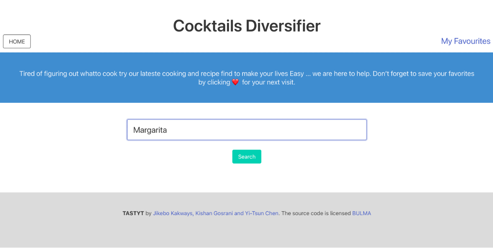
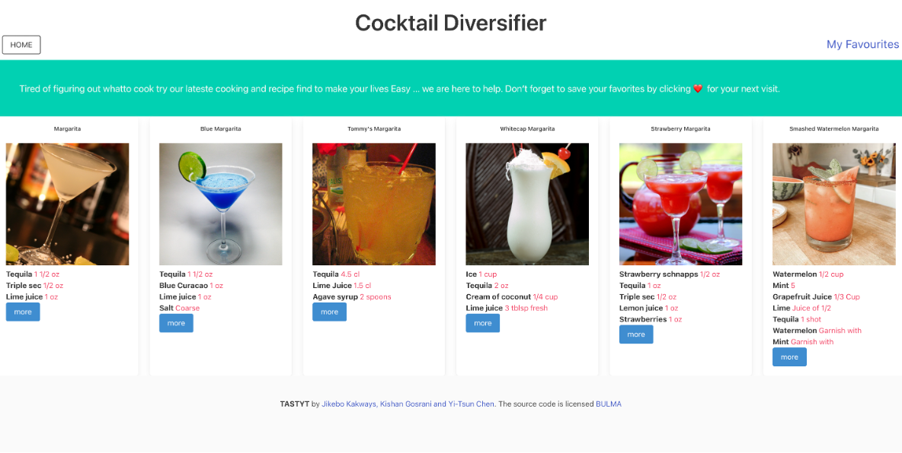
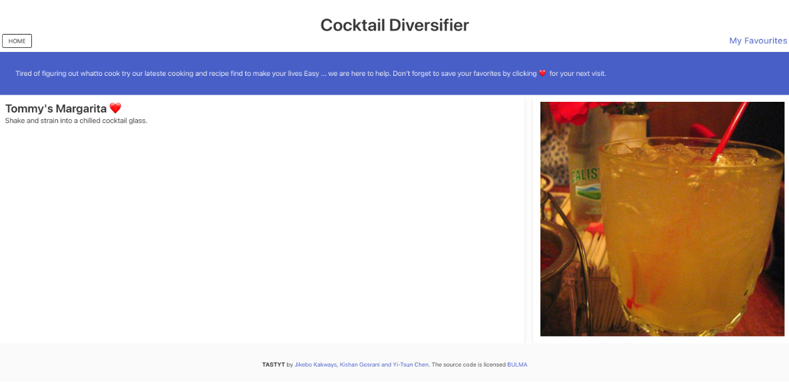
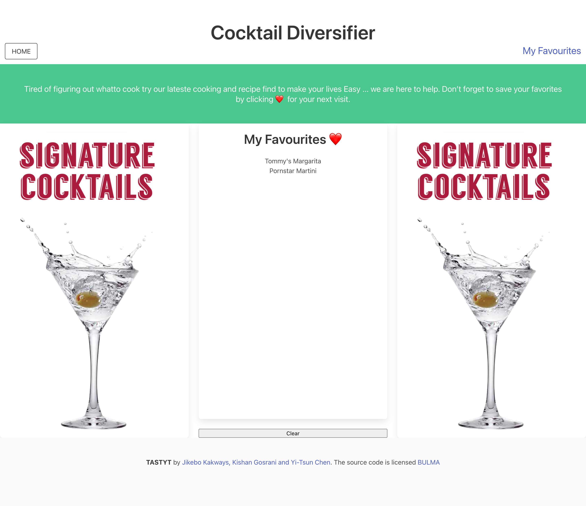

# 🖥 Cocktails Diversifier
An app enabling users to look up for a diverse range of cocktails with recipes, details and photos in relation to their search inputs.

## 📋 Description 

This project is to create an interactive and user friendly (responsive) app of a cocktails finder called "Cocktails Diversifier" and enabling the public in need of searching for varieties of cocktails found through the searched input. Cocktails information as key data will be retrieved from two open APIs from the TheCocktailDB (https://www.thecocktaildb.com/).  

Bulma as the css framework is also adopted as the styling reference for any futher refactoring. User can save their favored cocktails to be stored up to 12 at or cleared from the local storage and to be displyed in the page of "Favourites." 

### 👀 Key Features 

+ ⚓ Clear interface for users to seach more cocktails after the search input is requeted for more items.
+ ⚓ Date are updated lively
+ ⚓ Searched items can be stored and reviewed regardless of refreshing the webpage or app
+ ⚓ Clean and polish layout easily for operation
+ ⚓ Easy for updation on dinamical modification of HTML, CSS and javascript

## 📷 Screenshot 

HOME / INDEX PAGE

COCKTAILS PAGE

DETAIL PAGE

FAVOURITES PAGE

## 🔗 Link

https://chentriangoes.github.io/Recipe_finder/index.html
