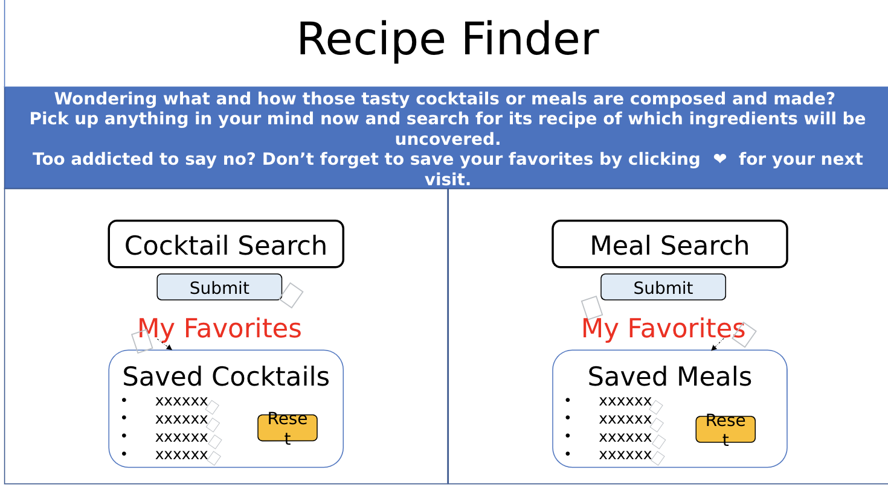
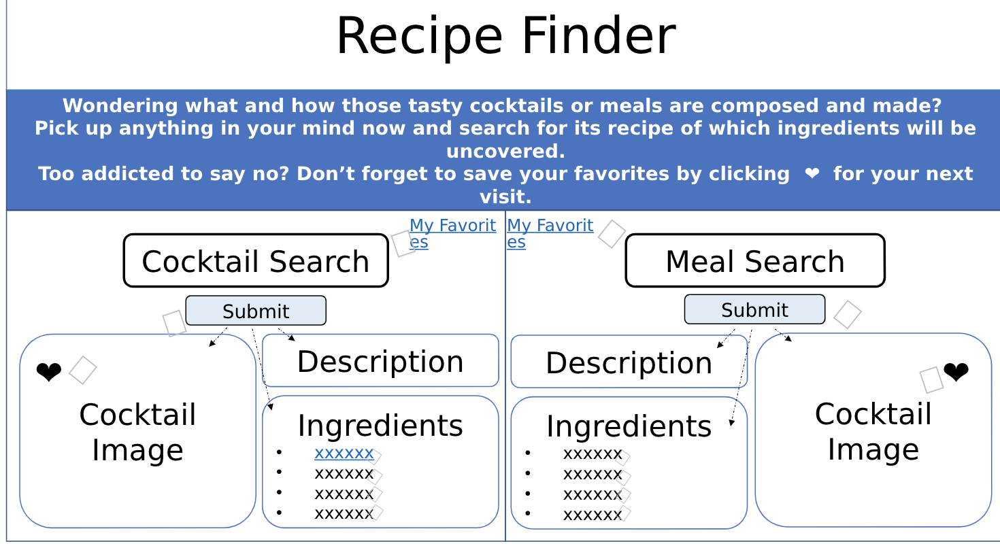

# RECIPE FINDER

# About the project

This is a presentation of a server side API which includes basic understanding of javascript functions, and css framework of Bulma. This project will also use the local storage so the user can save the recipes, so that when the page is refreshed the saved recipes can still be accessible.

This project is intended to help a user search their favorite cocktail and meal recipes so they can get the ingredients and make the desired meal or cocktail at home with ease. 

We are using 2 public APIs which can be found in the script.js file.

# Minimum Viable Product (prototype design - planning phase)

These above are our rough ideas of what we want our web app to look like
